# SPOT + ATS · 자연어 기반 자율순찰 Physical AI

**사람의 명령을 LLM이 이동·관측 계획으로 해석하고, 사족보행 로봇이 물리 시뮬레이션에서 실행하도록 연결하는 프로젝트이다.**

> “A구역에 가서 주변에 사람이 있는지 확인하고 관측 결과를 보고해.”
>
> 자연어 명령 → LLM 계획 → 실행 검증 → 이동·탐색·관측 → 결과 보고

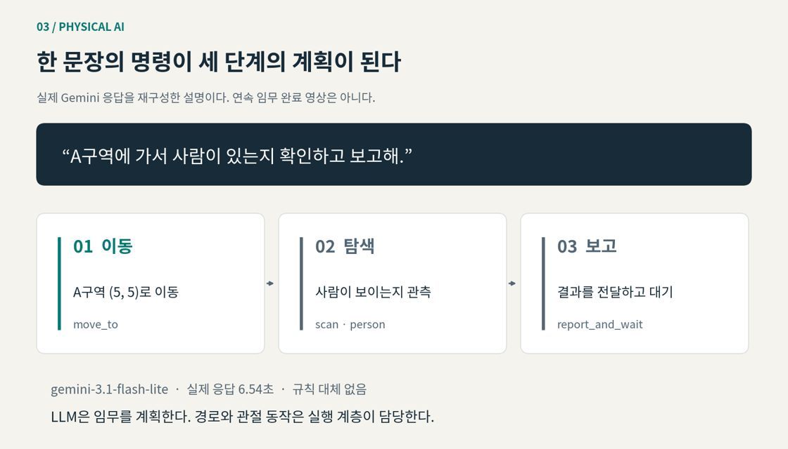

위 화면은 **실제 Gemini 응답 기록**을 이해하기 쉽게 재구성한 설명 애니메이션이다. LLM 계획 생성, Nav2 이동, 인식 시험은 각각 기록으로 확인하며, 전체 임무가 연속으로 완료됐다는 의미로 사용하지 않는다.

[핵심 개념](#1-왜-physical-ai인가) · [로봇 구조](#2-spot과-ats는-무엇인가) · [실행 영상](#4-실제로-무엇을-확인했는가) · [실행 방법](docs/RUNNING.md) · [통합 설계](docs/INTEGRATION.md)

## 1. 왜 Physical AI인가

순찰 로봇에는 “어디로 이동할 것인가”뿐 아니라 “무엇을 확인하고 어떤 결과를 돌려줄 것인가”라는 임무 수준의 판단이 필요하다. 이 프로젝트는 언어를 처리하는 **System-2**와 행동을 수행하는 **System-1**, 그리고 물리 세계를 모사하는 **Isaac Sim**을 연결한다.

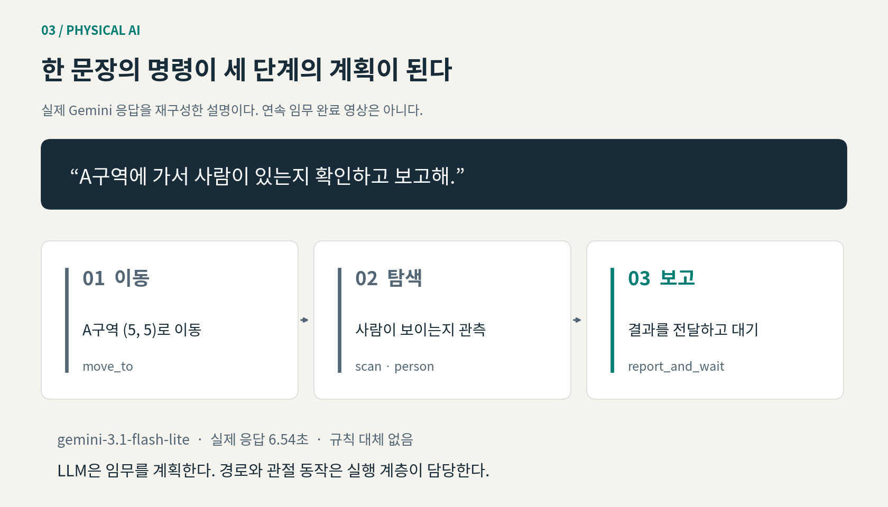

| 계층 | 맡은 역할 | 이 프로젝트에서의 의미 |
|---|---|---|
| 사용자 | 자연어로 임무를 전달한다 | 목적지·관측 대상·보고 조건을 표현한다 |
| System-2 / LLM | 명령을 구조화된 단계로 분해한다 | `move_to → scan → report_and_wait` 등의 계획을 생성한다 |
| 계획 검증 | 허용된 행동과 계획 형식을 검사한다 | 모델 응답을 그대로 관절 명령으로 사용하지 않는다 |
| System-1 | 단계를 실행하고 상태를 반환한다 | 이동·관측·대기를 구체적인 기능에 연결한다 |
| Nav2·보행 정책·ATS | 경로와 기구 동작을 수행한다 | 고수준 계획을 속도·관절 목표로 변환한다 |
| 센서·YOLO | 주변 환경을 관찰한다 | 영상·깊이·거리 정보와 객체 인식 결과를 제공한다 |

### 실제 LLM 명령 확인

기존에 설정된 **Gemini `gemini-3.1-flash-lite`**에 두 명령을 전달했다. 규칙 기반 대체 처리를 비활성화한 상태에서 계획 생성과 형식 검증이 완료됐다.

| 입력 | 실제 생성된 단계 | 응답 시간 |
|---|---|---|
| odom 좌표 `(2.0, 0.5)`로 이동하고 보고 | 이동 → 보고·대기 | 4.57초 |
| A구역에서 사람 유무 확인 후 보고 | A구역 이동 → person 탐색 → 보고·대기 | 6.54초 |

[실제 응답 JSON](results/llm_plans.json)에 명령, 모델, 응답 시간과 계획을 남겼다. API 키와 환경 파일은 포함하지 않는다. 현재 공개 실행기의 LLM 계획 연결은 **한 번의 이동과 보고를 다루는 제한된 실행 경로**이며, 다구역 탐색·재계획·최종 보고의 전체 폐루프는 후속 통합 검증 대상이다.

## 2. Spot과 ATS는 무엇인가

**Spot**은 Boston Dynamics의 사족보행 로봇이다. 네 다리로 이동하며 산업 현장의 관측·점검에 사용되는 플랫폼이다. 이 프로젝트에서는 Isaac Sim의 물리 모델과 학습된 보행 정책으로 이동을 구현한다. [제품 설명](https://bostondynamics.com/products/spot/)

**ATS는 Auto Targeting System**의 약자이다. 이 프로젝트에서는 Spot 상부에 결합한 2축 기구의 방향 제어를 다룬다. 좌우·상하 회전을 보행 제어와 분리하여 구성한다.

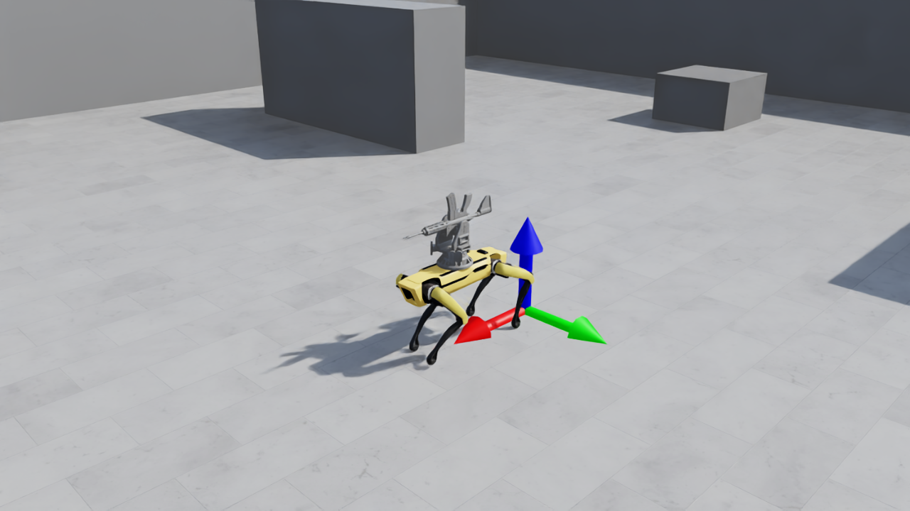

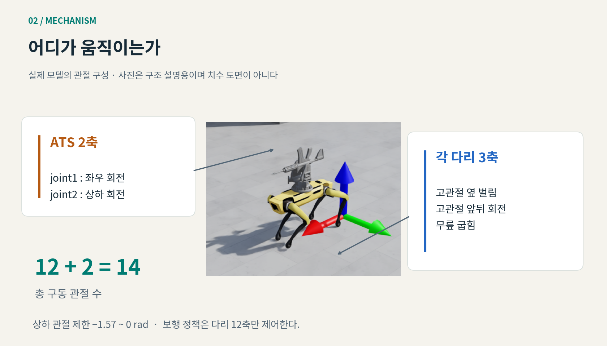

**네 다리 × 3축 = 12축**, 여기에 **ATS 2축**을 더하여 **총 14개 구동 관절**을 가진다. 관절·링크 이름과 제한값은 로드된 모델에서 읽는다. 그림은 기능 설명도이며 치수 도면이 아니다.

## 3. 어떻게 하나의 시스템으로 구성했는가

분산되어 있던 보행·센서·임무 구현을 기능별로 비교하고, ATS 탑재 상태에 맞춘 보행 정책을 실행 기준으로 선택했다. 통합 실행기는 같은 물리 스텝에서 보행, ATS 목표각, 센서 발행과 기록을 처리한다.

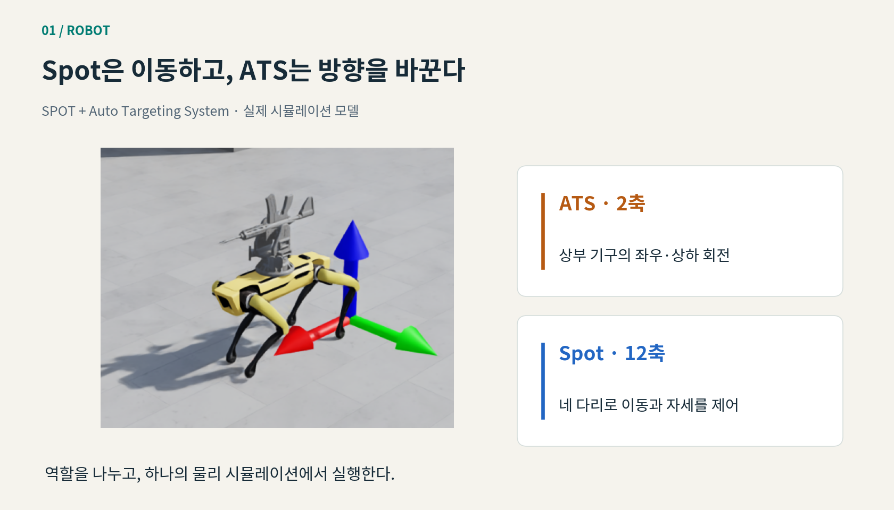

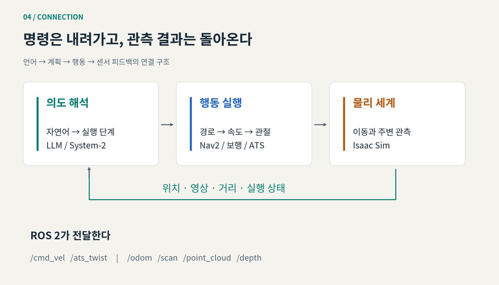

보행 정책은 관측 48차원과 다리 행동 12차원의 계약을 유지한다. ATS 관절에는 별도의 목표를 전달한다. Isaac Python 3.11과 시스템 ROS Python 3.10은 독립 프로세스로 실행하고 DDS로 연결한다.

| 인터페이스 | 전달하는 정보 |
|---|---|
| `/cmd_vel` | 이동 속도 명령 |
| `/ats_twist` | ATS 목표각 변화율 |
| `/odom`, `/tf`, `/clock` | 로봇 상태·좌표계·시뮬레이션 시간 |
| `/scan`, `/point_cloud` | 2D·3D 거리 관측 |
| `/yolo/image_raw`, `/depth` | RGB·깊이 영상 |
| `/spot_joint_states` | 14개 관절 상태 |
| `/plan` | Nav2가 생성한 이동 경로 |

## 4. 실제로 무엇을 확인했는가

### 보행 — 명령이 물리적 이동으로 이어지는가

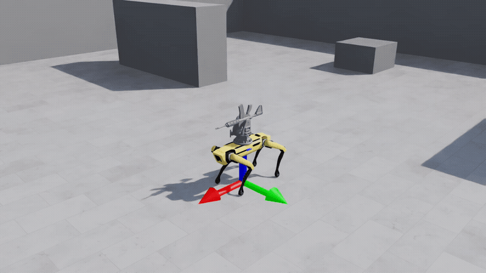

초기 보행 시험은 전진 0.3m/s를 요청하여 시뮬레이션 6초 동안 평면 변위 약 **1.81m**, 최대 기울기 약 **1.6°**를 기록했다. 위 GIF는 통합 실행기로 별도 촬영한 8초 보행이다. 실제 시간보다 느리게 계산될 수 있으며 영상은 시뮬레이션 시간 기준으로 재생한다. [MP4](media/walk.mp4) · [통합 보행 기록](results/walk.json)

### 인식 — 로봇 시야에서 사람이 검출되는가

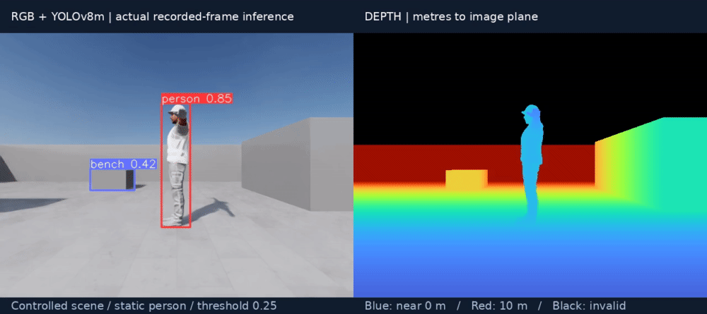

전방 3m에 정적 인물을 배치한 통제 장면을 촬영했다. 5초 영상에서 추출한 **25개 프레임 모두에서 person이 검출**됐다. 실제 YOLOv8m 추론이며 임계값은 0.25이다. 기록 영상에 대한 재생 시험이므로 실시간 성능이나 일반 환경 정확도로 해석하지 않는다. [추론 기록](results/detections.json) · [MP4](media/perception_sensor.mp4)

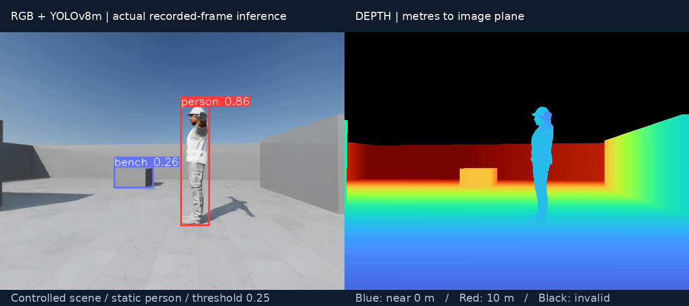

### 센서와 Nav2 — 관측·경로·실제 위치를 함께 확인한다

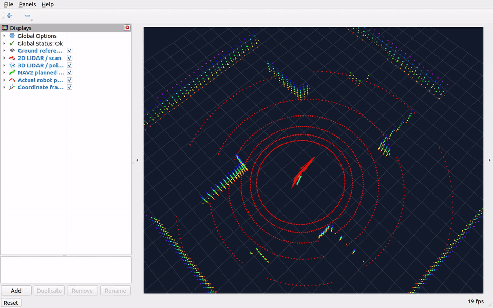

RViz에서 2D 스캔, 3D 포인트클라우드, TF, 오도메트리와 계획 경로를 표시한다. Nav2는 활성화와 `/plan` 생성, `/cmd_vel` 전달을 확인했다. 짧은 목표 이동의 세부 결과는 [검증 기록](docs/VALIDATION.md)에 정리한다. 전체 창고 순찰이나 실제 로봇 실증을 완료한 결과는 아니다. [RViz MP4](media/rviz.mp4)

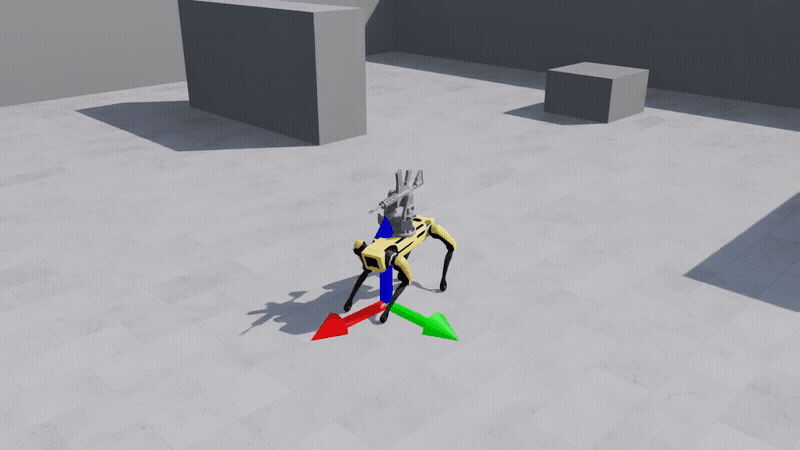

목표 `(2.0, 0.5)`에 대한 Nav2 액션은 **SUCCEEDED**를 반환했다. 위 GIF는 35초 기록 중 명령 전달 이후 구간이다. [액션·경로·속도 기록](results/nav_ros_retry.json) · [전체 MP4](media/ros.mp4)

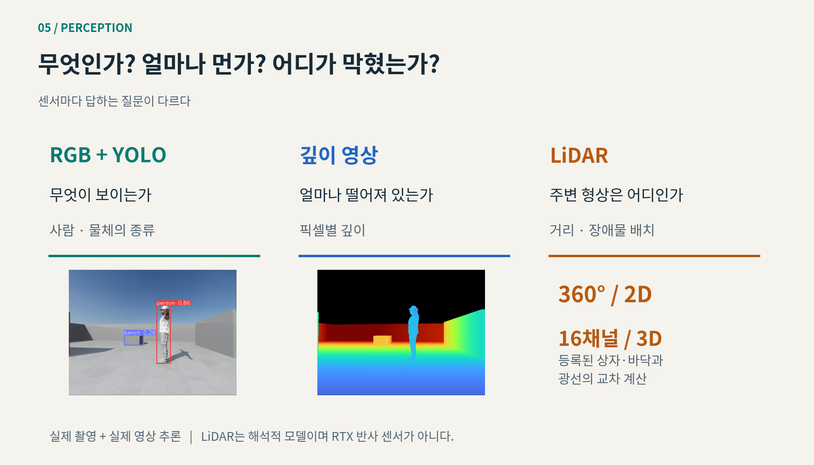

선택한 LiDAR는 등록된 창고 상자·바닥과 광선의 교차를 계산한다. RTX의 재질 반사 모델이나 동적 인물 감지 시험을 대신하지 않는다. 3D 포인트클라우드는 관측 시각화에 사용하며, 현재 Nav2 장애물 입력은 2D `/scan`이다.

## 5. 무엇이 남았는가

| 후속 과업 | 필요한 이유 |
|---|---|
| 자연어 → 다구역 이동 → 탐색 → 최종 보고의 연속 검증 | 개별 기능 검증을 임무 단위의 성공률로 확장한다 |
| 실제 ATS 시선과 카메라 TF의 일치 및 폐루프 관측 | 현재 촬영한 body 기준 관측 카메라와 ATS 기구 제어의 차이를 해소한다 |
| LLM 계획의 의미·좌표·실행 가능성 검사 강화 | 형식이 맞는 응답도 물리적으로 실행 불가능할 수 있다 |
| 동적 장애물과 실측 센서 특성 반영 | 정적 기하 센서 검증의 한계를 보완한다 |
| 위치추정·지도 오차를 포함한 장시간 순찰 | 현재 시뮬레이터 오도메트리 기반의 짧은 이동 시험을 확장한다 |
| 외부 자산 의존성 정리 | 공개 저장소만으로 재현 가능한 배포 범위를 넓힌다 |

## 6. 활용과 결론

이 프로젝트의 핵심은 **자연어 명령을 로봇이 실행할 수 있는 구조로 변환하고, 행동과 관측의 결과를 확인하는 연결 구조**이다. LLM 임무 계획, ATS 탑재 보행, RGB·깊이·LiDAR 관측, 객체 인식과 Nav2 인터페이스를 하나의 프로젝트 관점으로 정리했다.

산업 현장의 순찰·점검 임무 연구, 자연어 기반 로봇 인터페이스, 센서·계획 알고리즘 비교에 활용할 수 있다. 다음 단계는 개별 기능을 연결한 장시간 임무 검증과 실패 시 재계획이다.

## 실행·자료·출처

- [실행과 조작 방법](docs/RUNNING.md)
- [통합 선택과 설계 근거](docs/INTEGRATION.md)
- [검증 범위와 실제 결과](docs/VALIDATION.md)
- [외부 구성요소와 라이선스](THIRD_PARTY_NOTICES.md)

**USD·가중치·강의 PDF·인증정보는 포함하지 않는다.** 실행에는 별도의 로컬 모델·학습 정책·작업 공간이 필요하다. 구성요소의 출처와 배포 조건은 [외부 구성요소 고지](THIRD_PARTY_NOTICES.md)에 정리한다.
